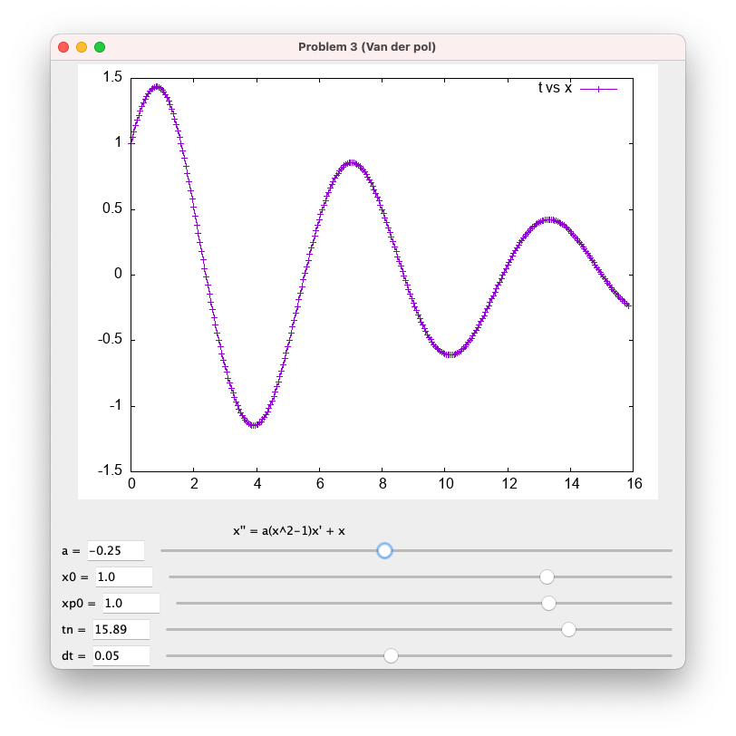

# CRAFT and FloatSmith

Most computers provide at least two different levels of floating-point precision (32-bit `float` and 64-bit `double`). Many calculations do not require high levels of precision, but it is very difficult for programmers to determine which calculations do and which do not. This project aims to analyze floating-point code automatically and report which regions must be in higher precision and which regions can use lower precision. CRAFT is a general framework for floating-point analysis and FloatSmith is a tool that integrates CRAFT and some other related tools to do precision analysis on source code.

- Faculty contact: Dr. Lam
- Paper: ["Automatically Adapting Programs for Mixed-Precision Floating-Point Computation"](https://w3.cs.jmu.edu/lam2mo/papers/2013-Lam-ICS.pdf)
- Paper: ["Fine-Grained Floating-Point Precision Analysis"](https://w3.cs.jmu.edu/lam2mo/papers/2016-Lam-IJHPCA.pdf)
- Paper: ["Tool Integration for Source-Level Mixed Precision"](https://w3.cs.jmu.edu/lam2mo/papers/2019-Lam-Correctness.pdf)
- CRAFT repository: [GitHub](https://github.com/crafthpc/craft)
- FloatSmith repository: [GitHub](https://github.com/crafthpc/floatsmith)
- Status: Suspended pending new student interest.

## ExamGen

Writing exams is a drudgery for most professors. Often, problems must be revised or re-parameterized to avoid repeating a previous semesters' question verbatim. Faculty in Computer Science are uniquely positioned to avoid some of this monotony because we are accustomed to writing scripts and programs to automate a process. This project aims to help automate the generation of new exams using a combination of question banks, scriptable questions, and potentially some application of machine learning to balance the length and difficulty of an exam.

- Faculty contact: Dr. Lam
- Status: Suspended pending new student interest.

## Less-Java

Less-Java is a new programming language designed for use in an introductory programming class like our CS 149. It is designed to be simple but also to contain all necessary concepts for teaching programming. We have a prototype compiler and are in the process of improving it and running user studies to validate the usefulness of the language. See the [tutorial](https://github.com/JMU-CS/less-java/wiki/Tutorial) for examples of code in Less-Java, and see our ["help wanted"](https://github.com/JMU-CS/less-java/issues?q=is%3Aopen+is%3Aissue+label%3A%22help+wanted%22) list for areas where you can get involved!

- Faculty contacts: Dr. Lam and Dr. Stewart
- Paper: ["Less-Java, More Learning:
  Language Design for Introductory
  Programming"](https://w3.cs.jmu.edu/lam2mo/papers/2019-Nasrawt-CCSC.pdf)
- Less-Java repository: [GitHub](https://github.com/JMU-CS/less-java)
- Status: Suspended pending new student interest.

## Shadow Value Analysis

Sometimes it is useful to run a program and perform a "shadow" calculation for every arithmetic operation. This allows you to try different precision levels or even different real-number encodings. It also enables you to visualize the changing levels of floating-point rounding error in the program's calculations.

- Faculty contact: Dr. Lam
- Paper: ["Floating-Point Shadow Value Analysis"](https://w3.cs.jmu.edu/lam2mo/papers/2016-Lam-ESPT.pdf)
- SHVAL repository: [GitHub](https://github.com/crafthpc/shval)
- Status: Suspended pending new student interest.

### ODE Viewer

Ordinary Differential Equations (ODEs) are used to model changes in real-world systems using numerical simulation. Often, mathematicians and scientists wish to visualize the results of these simulations and see what happens when particular parameters are changed. This is also useful to students who are learning about these systems. This project would involve extending a rudimentary tool written as part of a Summer 2021 project that was a collaboration between Dr. Lam and faculty in the Department of Mathematics and Statistics.

{width="400" class="align-center"}

- Faculty contact: Dr. Lam
- Repository: [GitHub](https://github.com/huberbp/jmodev)
- Status: Suspended pending new student interest.
