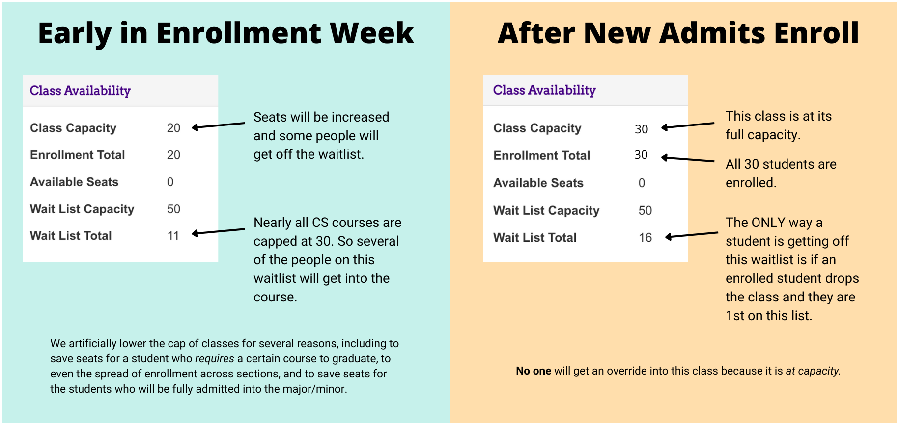

# Using the wait list in MyMadison

The wait list in MyMadison can be a powerful tool to enroll in the classes you desire, but it is not very intuitive. Here is an overview of how the wait list works:

-  All CS classes are being set up so that students enroll automatically from the wait list once more seats are added to a class.
- The Registrar's office runs processes at fixed times of the day to process the wait lists.
- When the wait list for a class is processed, and there are open seats, students from the first positions in the wait list are enrolled, as long as there are open seats left, and there are no "conflicts".
- When a student is next in line on the wait list for an open seat, but has a conflict, that student is skipped, and the next student is considered, instead.
- Should there be enough open seats in the class so that the entire wait list is processed, and there are still open seats remaining, the class is then opened up, and anybody without conflicts can register for the remaining open seats. Students with conflicts who were skipped when the wait list was processed remain on the wait list.
- A conflict is one of the following:
    - There is a hold on a student's account
    - The student does not meet the prerequisites for the class
    - The student is already enrolled in a different section of the same class
    - The student is already enrolled in a different class where class times overlap

## Using the wait list to swap classes

Because of the way the wait list works, if you merely use the "Add" tab in MyMadison to get on the wait list for a class, you will not be considered if you already have a class during the same time or are enrolled in a different section of the same class once more seats become available. To use the wait list to get into a different section of a class or to swap out a class that has the same time, **you must use the "Swap" tab** in MyMadison to enter the wait list. If you use "Swap" then the last two bullets above (definition of conflicts) are not considered conflicts anymore.

[Tutorial video](https://www.jmu.edu/computing/ittraining/e-training/mymadison-swap-a-class/index.html)

### How (and why) to Check the Waitlist

<https://www.youtube.com/watch?v=w8t9YwM007w>

### A note on the WAIT part of the Waitlist

I get a lot of emails from students asking when they will get off the waitlist. The answer could very well be never. Just because you are on the waitlist for a class does not mean you will get in.

Here are the things to look at when assessing your chances of getting off the waitlist:

{width="600"}
