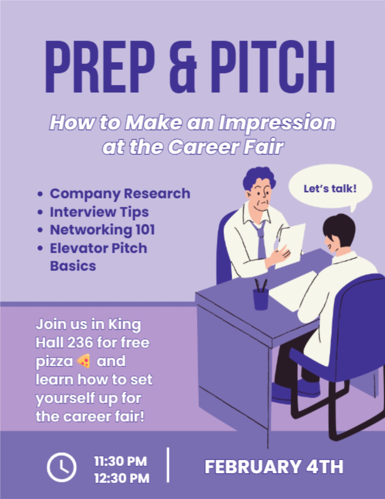

# Prep & Pitch (02/04)

The CS Ambassadors are hosting a Prep & Pitch event on ==Wednesday, February 4th at 11:30am-12:30pm in King 236==.
**All CS and IT students, faculty, and staff are invited!**

Come learn how to prepare for and succeed at career fairs! This event will include:

- Career fair preparation strategies.
- How to craft a compelling elevator pitch.
:pizza: P.S... Free pizza! :pizza:

---

