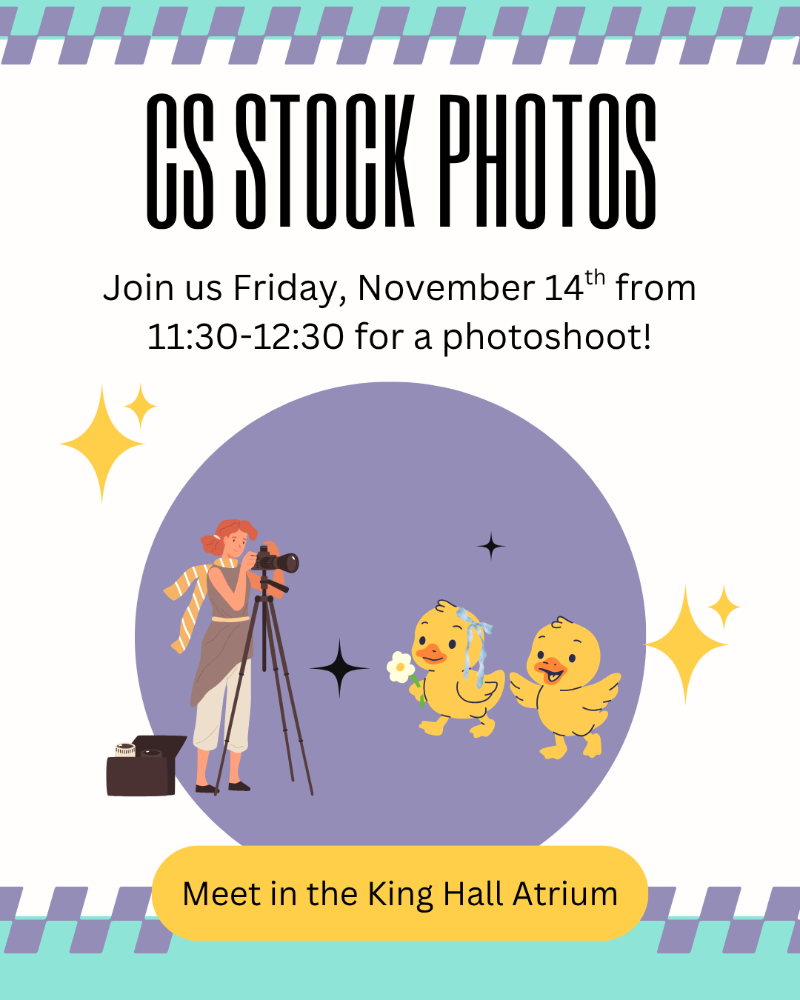

# NEW Stock Photos

## Summary

📸 Call for CS Models: Stock Photo Shoot at JMU!
Hey JMU CS students! 👋

The Computer Science Department is hosting a Stock Photo Shoot event and needs you to participate! We're looking to capture fresh, authentic images of our students in action—collaborating, coding, studying, and utilizing department resources.

These new photos will be used across JMU's websites, brochures, and promotional materials to showcase our vibrant community.

- What: A casual photo shoot to update the department's library of stock images.
- Why: Help us visually represent the JMU CS experience
- Who: All current CS students are welcome!

We hope to see you there!
{width="600" class="align-center"}
