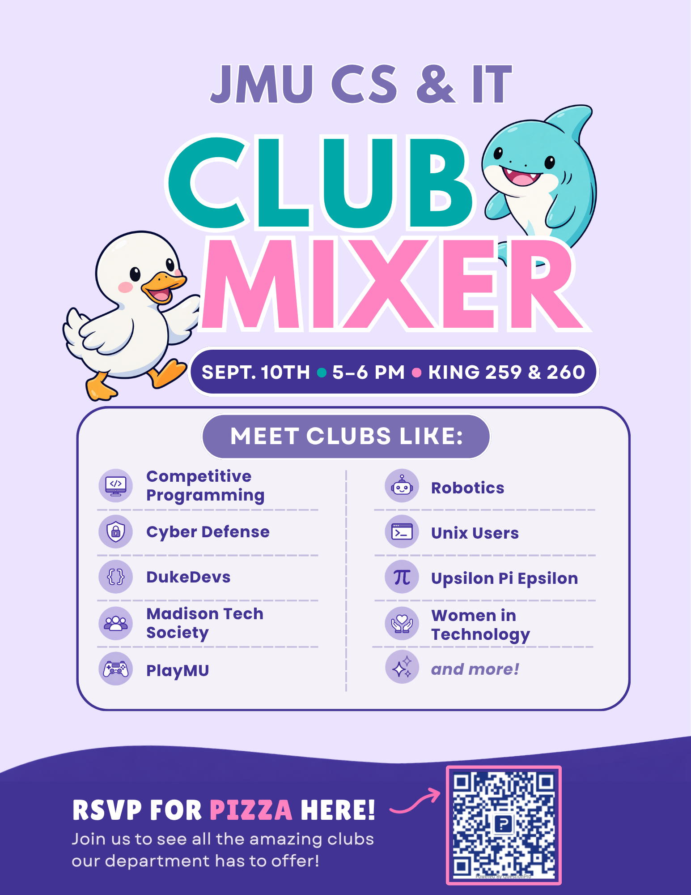

The CS & IT Ambassadors are hosting the CS & IT Club Mixer on ==Thursday, September 10th at 5–6pm in King 259 & 260==.
**All CS and IT students are invited to join!**

Come meet the clubs our department has to offer, including:

- Competitive Programming

- Cyber Defense

- DukeDevs

- Madison Tech Society

- PlayMU

- Robotics

- Unix Users

- Upsilon Pi Epsilon

- Women in Technology

- and more!

**RSVP for pizza using the QR code on the flyer below!**

([or you can RSVP via this convenient link 😆](https://jmu.questionpro.com/t/AaDLXZ9jdy))
---

