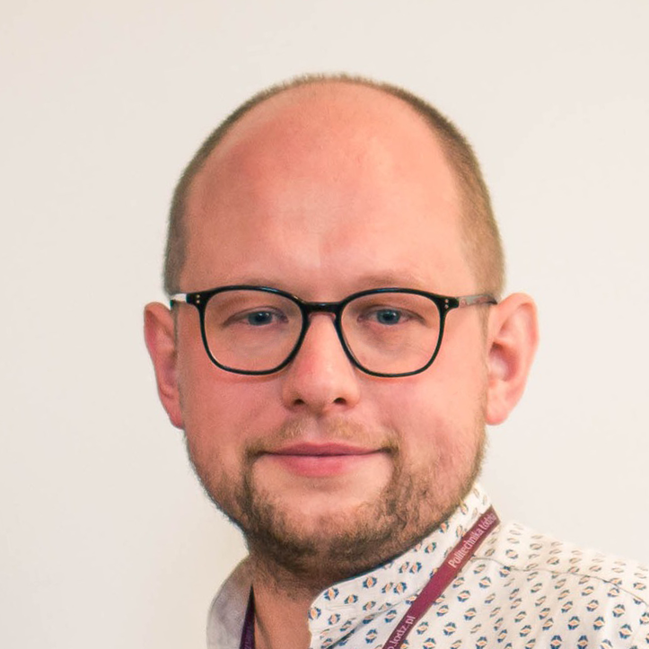

## Abstract

In this talk, I will explore what fascinates me about the field of Human-Computer Interaction (HCI), especially as technology becomes an increasingly integral part of our everyday lives. I will examine how we can deepen our understanding of technology to ensure it genuinely benefits its users. I will start by focusing on one of my preferred areas of interactive technology: those designed for physical activity. These technologies, while appearing straightforward, often raise profound questions about the future of our relationship with technology.
This exploration leads to intriguing considerations—can technology become conscious? Could it one day ‘perceive’ our physical state or even empathize with us? However, these exciting possibilities come at a cost. What happens when technology crosses personal boundaries, becoming intrusive or unsettling? I suggest that a deeper understanding of how technology causes ambiguous feelings is key for the future of interaction design. Ultimately, I hope to demonstrate that HCI is not only about designing devices and interfaces but also about understanding their broader impact on the human experience.

## Bio

[Paweł W. Woźniak, tekn. dr.](informatics.tuwien.ac.at/people/pawel-wozniak) is professor for human-computer interaction and head of research unit at TU Wien. Previously, he was associate professor at Interaction design, Chalmers University of Technology, assistant professor for Human-Centred Computing at Utrecht University and postdoctoral fellow at the Chair for Human-Computer Interaction and Socio-Cognitive Systems, University of Stuttgart. Paweł received his PhD degree in Human-Computer Interaction from Chalmers in 2016. Paweł’s key interests lie in the intersection of technologies, sport and wellbeing. His focus is on understanding the everyday experiences of physical activity to design better technologies that support wellbeing. To this end, he conducts studies in personal informatics, building an understanding of how uses gather, process and reflect upon data about their lives. Paweł loves to build stuff and he builds devices for sports particularly often. He also conducts research in multi-surface interactions, augmenting sensory perception and creepy experiences of interactive technologies. Paweł received numerous paper awards (CHI, DIS, MobileHCI, EICS) and assumed multiple roles of trust in the academic community (general chair of TEI’23, ISS’21, SIGCHI Poland Chair).

