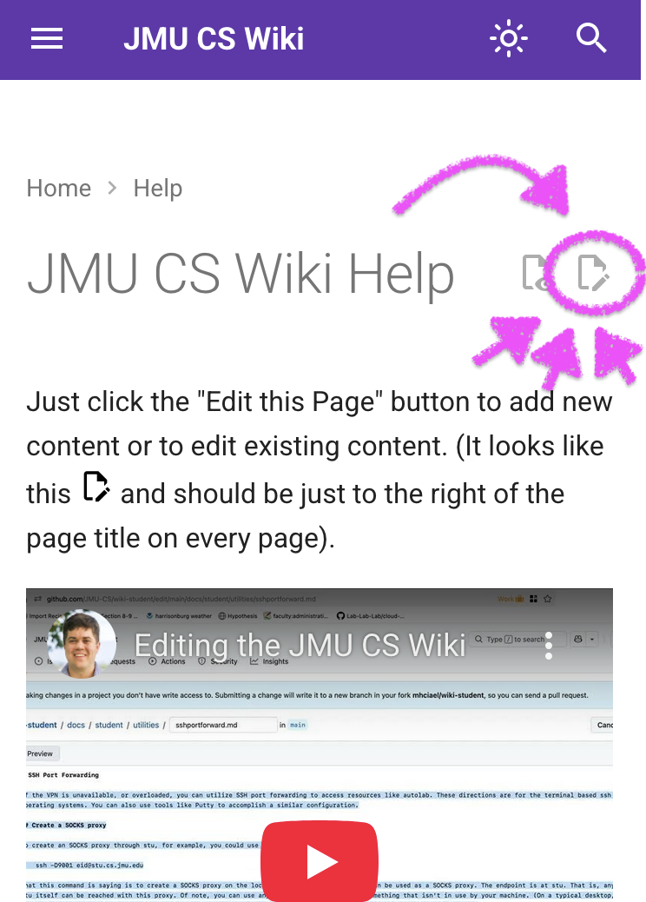

# JMU CS Wiki Help

Just click the "Edit this Page" button to add new content or to edit existing content. (It looks like this <svg xmlns="http://www.w3.org/2000/svg" viewBox="0 0 24 24" width="20"><path d="M10 20H6V4h7v5h5v3.1l2-2V8l-6-6H6c-1.1 0-2 .9-2 2v16c0 1.1.9 2 2 2h4zm10.2-7c.1 0 .3.1.4.2l1.3 1.3c.2.2.2.6 0 .8l-1 1-2.1-2.1 1-1c.1-.1.2-.2.4-.2m0 3.9L14.1 23H12v-2.1l6.1-6.1z"></path></svg> and should be just to the right of the page title on every page). See the annotated screenshot below.

## Quick Wiki Editing Demo

<iframe width="560" height="315" src="https://www.youtube.com/embed/zhHBWFZ2VOo?si=HyxqRmO15Ljxh5is" title="YouTube video player" frameborder="0" allow="accelerometer; autoplay; clipboard-write; encrypted-media; gyroscope; picture-in-picture; web-share" referrerpolicy="strict-origin-when-cross-origin" allowfullscreen></iframe>

This video illustrates all the steps:

0. Except for the prerequisite of having a GitHub Account! 😆
1. Click "Edit this page"
2. Click 🟩 Big Green Button™️ #1, labeled `Fork this repository`
4. Edit the content. The syntax is [Markdown](https://daringfireball.net/projects/markdown/syntax), but you can also use HTML.
    1. Ideally check the preview tab at the top to ensure it looks right.
5. Click 🟩 Big Green Button™️ #2, labeled `Commit changes...`
    1. optionally add information that explains your edit.
6. Click 🟩 Big Green Button™️ #3, labeled `Propose changes`
    1. take a last look that you made the changes you wish
7. Click 🟩 Big Green Button™️ #4, labeled `Create Pull Request`
8. Click 🟩 Big Green Button™️ #5?! 😅, labeled `Create pull request`
9. Wait for a wiki maintainer to `merge` your "PR".

