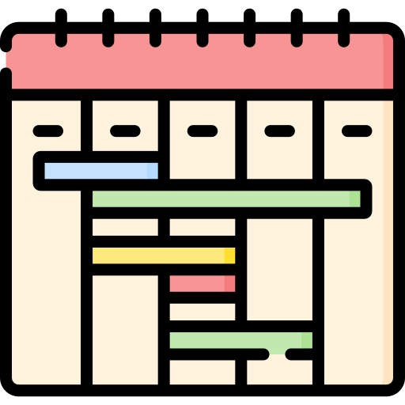

---
hide:
  - navigation
  - toc
title: Home
---

# JMU Department of Computer Science Wiki

## Quick Links

- [{.hello} Advising](./department/files/cs-advising.md)
- [{.hello} Clubs](./student/files/clubs.md)
- [{.hello} Dept. Info](./department/)
- [{.hello} Events](./events/)
- [{.hello} First Years](./firstyear/)
- [{.hello} Office Hours](./department/files/officehours.md)
- [{.hello} Schedules](./department/files/schedule_spring2026)
- [{.hello} Seniors](./seniors/)
- [{.hello} TA Hours](./department/files/cs-success.md)
- [{.hello} Tech Refs](./technical-ref/)

[Faculty Login](./faculty){ .md-button }

---

This wiki contains information that is relevant to students, faculty, and staff at the JMU Department of Computer Science. All members of the department community are welcome to contribute to building this knowledge base and keeping it up to date. 

