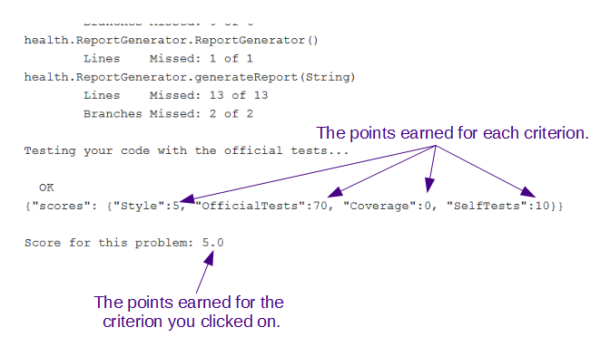

# Help Understanding the Grade Report

The grade report shows the criteria that are used to determine the total grade, the points allocated to each criterion, and the points earned for each submission. It looks something like the following.

If you click on any of the "points earned" you will receive feedback on **all** criteria. That looks something like the following.

Note that, oddly, the line that reads "Score for this problem" is **only the points earned on the criterion that you clicked on**. The points earned on all of the criteria are shown just above that line. (For those who are curious about the format of this line, it uses [JSON](https://www.json.org/), the JavaScript Object Notation. This is how the autograder transmits information back to Autolab.)
