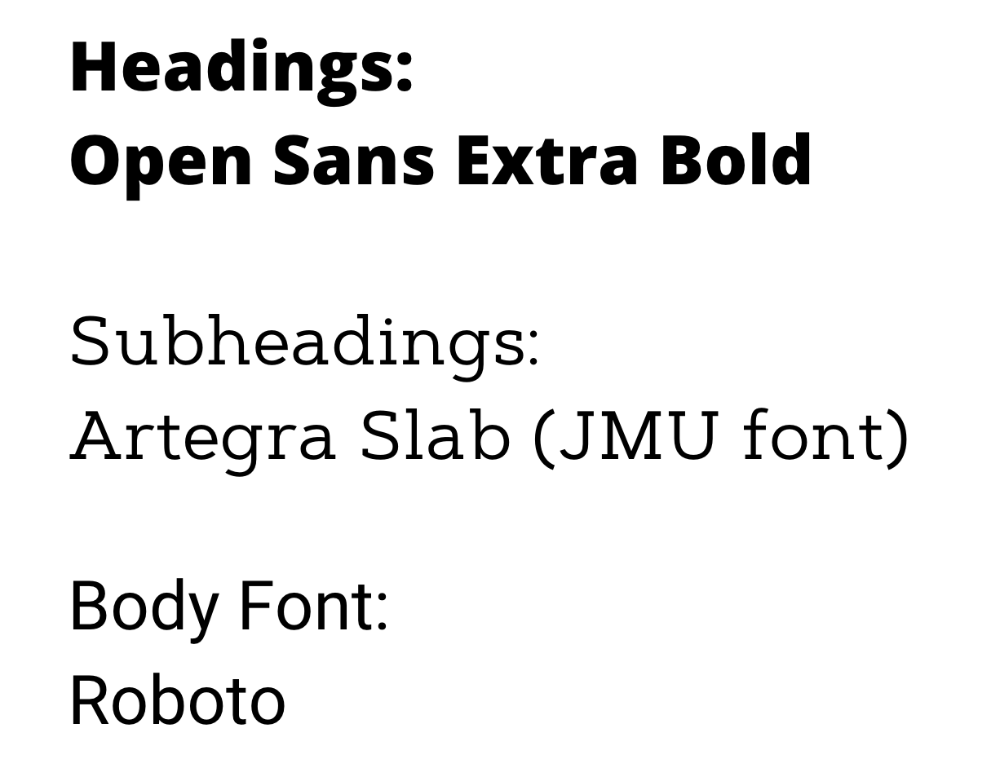

# CS Branding

## CS Department branded colors

{width="1000"}

- **JMU Slate Gray**: `#333333`
- **Ice Blue**: `#8EE4D7`
- **JMU Purple**: `#450084`
- **Teal**: `#009698`
- **JMU Light Gold**: `#F4EFE1`

## CS Department branded fonts

{width="600"}
