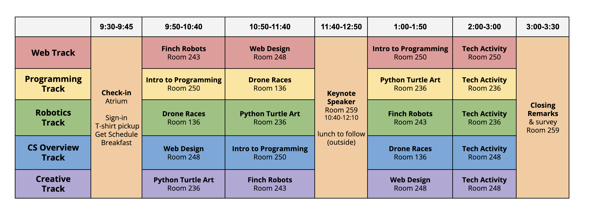
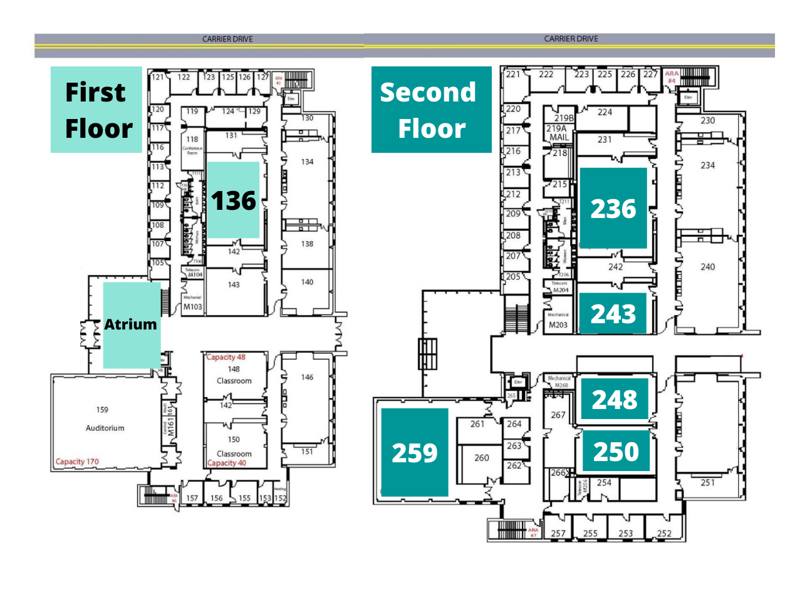

# DIGITAL 2021

Previous DIGITAL events:

- [2018 Website](https://digital.cs.jmu.edu/2018/)
- [2019 Website](https://digital.cs.jmu.edu/2019/)

## Participants SURVEY 2021

* [Pre-survey 2021](http://jmu.co1.qualtrics.com/jfe/form/SV_4URQo7UDhLkzXpk)
* [Post-survey 2021](http://jmu.co1.qualtrics.com/jfe/form/SV_25oXYTIwYVwmozc)

## Volunteer Feedback 2021

* [Volunteer Feedback 2021](http://jmu.co1.qualtrics.com/jfe/form/SV_d5nY8sOXc65pk22)

## 2021 Schedule

9:00-9:30: Check In and Breakfast, Atrium  
9:30-9:45: Introduction from JMU Computer Science Dept, Atrium  
9:45-9:50: Break into Station Groups, Atrium  
9:50-10:40: Station 1  
10:50-11:40: Station 2  
11:40-12:10: Speaker Lynn Lambert, CNU, “But what if I don’t have a passion?”, Room 259  
12:10-1:00 Box Lunch, eating outside  
1:00-1:50: Station 3  
2:00-3:00: Tech Gift Activity  
3:00-3:30: Closing, Room 259  
3:30: Depart  

## Workshops

- [Finch Robots](finch.md)
- [Intro to Programming](https://www.dropbox.com/sh/waxuo6hqpa65dm9/AADaB43qQPg7N1HaWToKzuhVa?dl=0)
- [Drone Races](drones.md)
- [Web Design](web-design.md)
- [Python Turtle Art](turtle.md)
- [Tech Gift Activity](https://w3.cs.jmu.edu/duanzx/Tech_gift.html)

{width="1000" class="align-center"}

{width="1000" class="align-center"}
