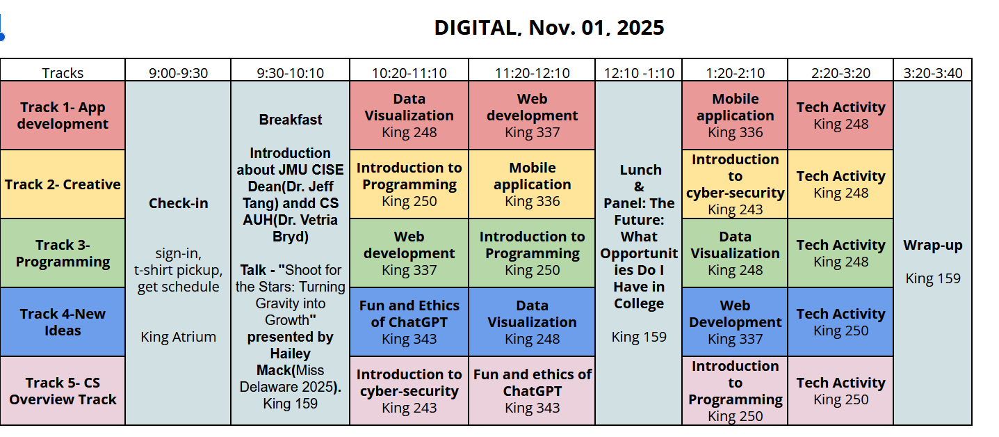
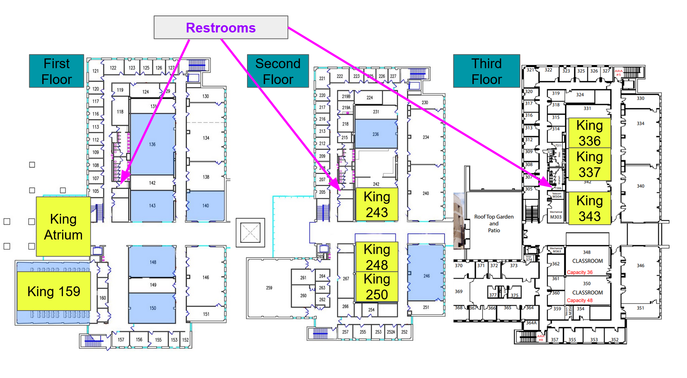

# DIGITAL 2025

**Schedule:**

{width="800"}

**Survey:**

- [Participants Pre Survey](https://jmu.co1.qualtrics.com/jfe/form/SV_eERzAATBje6fvb8)
- [Participants Post Survey](https://jmu.co1.qualtrics.com/jfe/form/SV_8CI2N94yaH2GSIC)
- [Volunteer feedback Survey](https://jmu.co1.qualtrics.com/jfe/form/SV_3FbU4iGaNwio8se)

**Workshops within the Tracks:**

**Fun and ethics of ChatGPT:**
Are you curious about the exciting world of AI-powered conversation? Join us for an interactive and thought-provoking workshop where we dive into the fascinating capabilities of ChatGPT, an advanced AI language model. Discover the creative possibilities, ethical considerations, and societal impact of using AI for conversation and expression. [Tutorial](https://drive.google.com/drive/folders/1sn_gKA-8rqoyWBh_Fyn33KtiQYeMFS47?usp=sharing)

**Data visualization:**
Discover how to make data come alive! Join us for a hands-on Vega-Lite workshop and learn to create your own visualizations. No coding experience needed.[Tutorial](https://drive.google.com/drive/folders/1tv8drJeyP4ZQf0pqDa-B34M59apfsXZ-?usp=sharing)

**Web development:**
Have you ever wondered how the websites you use on the internet are created? In this exciting session, you will learn all about web design and how to make your own website. You will get the chance to see how various components interact in order to construct the websites you use every day\

**Introduction to programming:**
Bring your problem-solving skills to this hands-on session as you dive into programming with Python—one of the most widely used languages in the tech industry today. You’ll learn the fundamentals of coding using Python. No prior programming experience is required—just curiosity and creativity\, [Tutorial 2](https://w3stu.cs.jmu.edu/peter2av/digital/)

**Mobile App:**
Learn how to create a mobile app using App inventor! In this interactive session, you will design and implement a fun app to show off to friends and family. Bring your creativity to this workshop and make your first app! No programming experience is required.[Tutorial](https://drive.google.com/drive/folders/1Ufv2vhfJd_1GXyYWx84JJWG7_g8jBhBD?usp=sharing)

**Introduction to cyber-security:**
Curious about how to protect the digital world? Join this exciting workshop where you’ll explore fundamental cybersecurity concepts and hands-on penetration testing tools. Learn how hackers think and how to defend against them—no prior experience needed! Step into the thrilling world of ethical hacking and cyber defense\

**Tech Activity:**
A pocket-sized computer that introduces you to the fundamentals of software and hardware interaction. In this hands-on session, you'll explore coding and electronics through fun projects, learning how to bring your ideas to life with this versatile device. Whether you're a beginner or looking to expand your skills, these activities are perfect for anyone interested in the exciting world of technology\

{width="800"}
