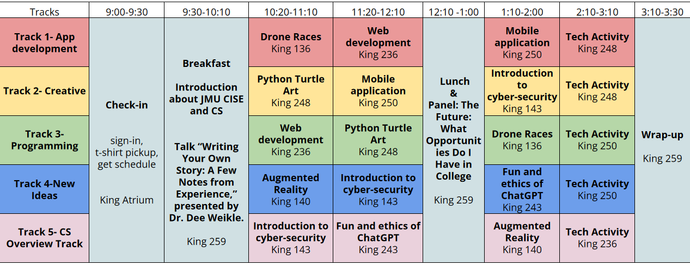
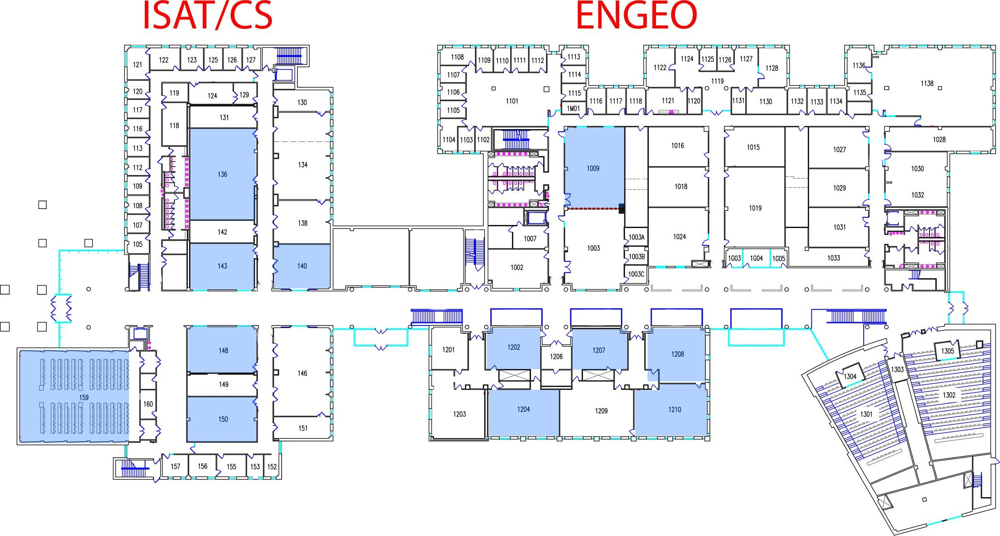
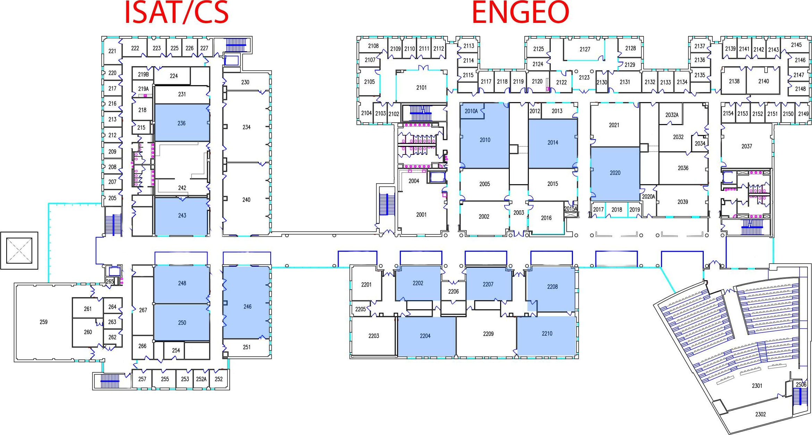

# DIGITAL 2024

**DIGITAL - Dukes Inspiring Girls Into Technology Across Limits**

Nov 2, 2024, James Madison University

## 2024 Schedule

{width="800"}

[Participants Pre Survey](https://jmu.co1.qualtrics.com/jfe/form/SV_9WXKSHSRjDoKKKG)

[Participants Post Survey](https://jmu.co1.qualtrics.com/jfe/form/SV_bdvwfYNk31fOWTY)

[JMU Faculty and Student Volunteer Post Survey](https://jmu.co1.qualtrics.com/jfe/form/SV_878WbAO0hL7Mn3g)

## Workshops

**[Introduction to cyber-security](https://drive.google.com/drive/folders/1nw7X7RkMRi5jEEMP0iThsLolIzx9v3Fn):** Curious about how to protect the digital world? Join this exciting workshop where you’ll explore fundamental cybersecurity concepts and hands-on penetration testing tools. Learn how hackers think and how to defend against them—no prior experience needed! Step into the thrilling world of ethical hacking and cyber defense!

**[Augmented Reality](https://drive.google.com/drive/folders/1zbZMyxh3cBStih_p4TE8QPwFT5uyQ9TZ):** Beyond Reality: Creating Virtual Reality Apps. Ever want to create a world that you could jump into and explore? In this session, you'll get to experience virtual reality first-hand, and use HTML to create your very own virtual world! No prior programming experience is necessary.

**[Web development](https://drive.google.com/drive/folders/1PygnzyZrjZpqOSoEh8UBw9nl_zVcNV-D):** Have you ever wondered how the websites you use on the internet are created? In this exciting session, you will learn all about web design and how to make your own website. You will get the chance to see how various components interact in order to construct the websites you use every day!

**[Drone races](https://drive.google.com/drive/folders/1-BQcNrnPrkbI213zccbKzLFmUfDFUVqC):** Have you ever wanted to fly your own drone? This is the session for you! In this challenging workshop, you will learn how to control a drone with code and fly it through an obstacle course. Show off your skills and see if you can navigate the drone through the entire course!

**[Python Turtle Art](https://drive.google.com/drive/folders/1snZA5_kKMZQ-5qxEK5ue0G4eutSRrksf):** Bring your problem-solving abilities to this session as you learn how to program with Python! Python is one of the most widely-used programming languages in the tech industry today. In this workshop, you will learn how to navigate a turtle across the screen using the Python language! No prior programming experience is necessary.

**[Mobile App](https://drive.google.com/drive/folders/1S2zxGNB3ZHlS2ORPaF_IrfH71AacF3GF):**Learn how to create a mobile app using App inventor! In this interactive session, you will design and implement a fun app to show off to friends and family. Bring your creativity to this workshop and make your first app! No programming experience is required.

**[Fun and Ethics of ChatGPT](https://drive.google.com/drive/folders/1Df1r-ekv5Z4uoIyI3zSkxBkcxn1DgLd7):** Are you curious about the exciting world of AI-powered conversation? Join us for an interactive and thought-provoking workshop where we dive into the fascinating capabilities of ChatGPT, an advanced AI language model. Discover the creative possibilities, ethical considerations, and societal impact of using AI for conversation and expression.

## Tech gift activities:

[Tech Activity Tutorial](https://docs.google.com/document/d/1rD8Q4R9drcOh2FroOL46uF4DR8-cwV6G/edit)

A pocket-sized computer that introduces you to the fundamentals of software and hardware interaction. In this hands-on session, you'll explore coding and electronics through fun projects, learning how to bring your ideas to life with this versatile device. Whether you're a beginner or looking to expand your skills, these activities are perfect for anyone interested in the exciting world of technology!

{width="600"}

{width="600"}
