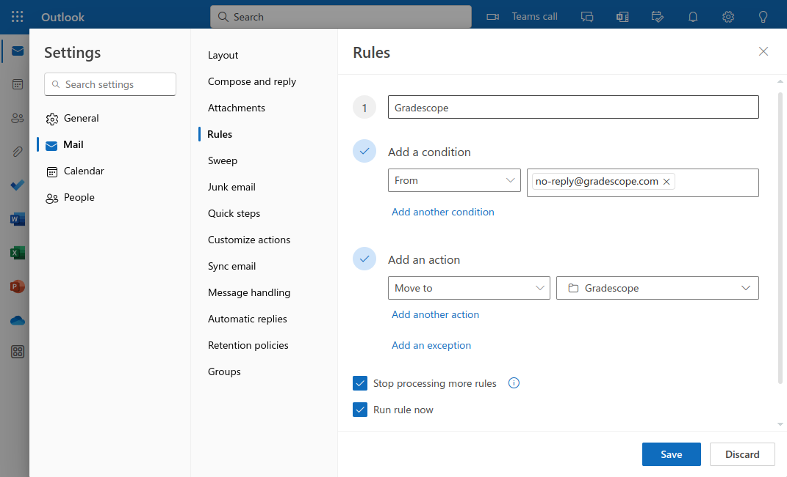

# Gradescope Email Filter

***Are you tired of getting emails from Gradescope?***

1. Go to <https://dukes.jmu.edu/> (Outlook)
2. On the left, click *Create new folder*
    * Note: You might have to click :material-menu: first
    * Name the new folder `Gradescope`
3. On the top, click :octicons-gear-24: *Settings*
    * Search for `Inbox rules`
    * Click :octicons-plus-24: *Add new rule*
    * See screenshot below
        * Name: `Gradescope`
        * Condition: From <no-reply@gradescope.com>
        * Click `Add another condition`
        * Condition: Subject includes `submitted`
        * Action: Move to `Gradescope`
        * Check: *Rule rule now*
4. Optional: Repeat steps 2 and 3 for other offenders
    * Canvas Notifications: <notifications@instructure.com>
    * Piazza Notifications: <no-reply@piazza.com>
    * Subject includes `[JMU INFORMATIONAL E-MAIL]`

!!! warning

    Filtering email is helpful, but you still need to read all messages!
    Don't forget to check your Gradescope, Canvas, and other new folders
    regularly so you don't miss anything important.
