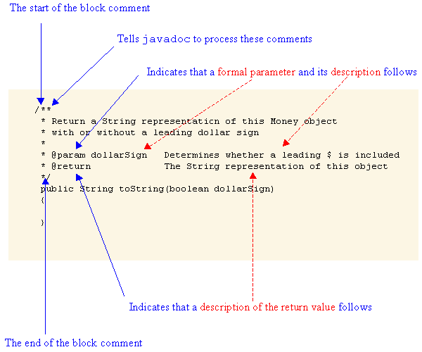

# The Java Documentation Generator (javadoc)

## Overview

`javadoc` is a tool that creates HTML pages (often called "java docs") from documentation included in Java source files.

`javadoc` looks for specially-formatted block comments (that start with `/**` and end with `*/`) for information to include in the HTML pages it creates. These comments include a main description followed by one or more *tags*.

## Tags for Constructors and Methods

The most frequently-used tags for constructors and methods are:

- @author *text*
- @deprecated *text*
- @param *nametext*
- @return *text*
- @since *text*
- @throws *classtext*

Below is an annotated example of a method that contains `javadoc`-formatted comments:



## Tags for Classes and Interfaces

The most frequently-used tags for classes and interfaces are:

- @author *text*
- @deprecated *text*
- @since *text*
- @version *text*

## An Example

Below is a descriptive example of a class that contains `javadoc`-formatted comments:

``` java
/**
 * This is where the description of the class goes.
 * You can include HTML tags if you would like.
 *
 * @author      Author's name
 * @version     Version number
 */
public class ClassName
{
    /**
     * This is where the description of the method goes.
     *
     * @param param1    Description of the first parameter
     * @param param2    Description of the second parameter
     * @return          Description of what is returned
     */
     public ReturnType methodName(Type1 param1, Type2 param2)
    {

    }
}
```

## Executing the Tool

The `javadoc` tool can be executed at the command line. It has the following syntax:

<code>
javadoc \[*options*\] \[*packages*\] \[*files*\]
</code>

For example:

`javadoc Calculator.java Controller.java`

will create the HTML pages for the source files named `Calculator.java` and `Controller.java`.

Many integrated development environments also have the capability of running the `javadoc` tool, including [Eclipse](../eclipse/help.md#creating-html-documentation).

Note that the `javadoc` tool generates a large number of "supporting" files even if you only generate documentation for a single class. The file `index.html` is the "main" page.

## Troubleshooting

If you're style-checker gives you a message like `@param tag must be preceeded by a blank line`, it probably means that there is extra whitespace on the line the line containing the `@param` tag. Delete anything (even if you can't see it) that is after the asterisk on the "blank" line.

## For More Information

The `javadoc` tool is very powerful and has a number of capabilities that are not discussed here. For more information, see:

- [Using the javadoc Tool](http://docs.oracle.com/javase/8/docs/technotes/tools/windows/javadoc.html)
- [Writing Comments for the javadoc Tool](http://www.oracle.com/technetwork/articles/java/index-137868.html)
