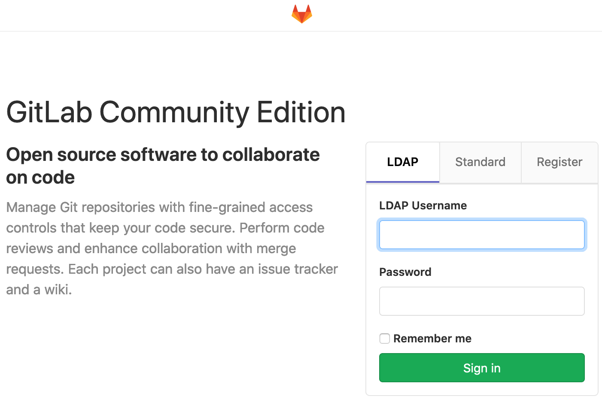

# Mattermost

Mattermost is a team-chat service (a free and open source alternative to e.g. slack.com, discordapp.com, teams.microsoft.com ). You might use this to chat generally with students, faculty, and alumni of JMUCS, with clubs or other special interests (such as professors' research labs), or to chat with TAs for help with coursework.

## Quick Overview

Find a quick tour here <https://www.youtube.com/watch?v=8uBzF1K9Sf0>

## Signing Up/Signing In

You can sign in with your JMU EID by:

1.  Going to <https://chat.cs.jmu.edu>
2.  clicking "Sign in with: GitLab" (see figure)
    - {width="400"}
        - on the resulting page (with the "LDAP" tab selected, as in the figure), enter your JMU EID (leave out the end i.e. @dukes.jmu.edu or @jmu.edu) and associated password (as you would on MyMadison).
    - {width="400"}
        - The first time you do this, you may be asked to grant permission. You should do so.

## Making the... most of Mattermost 😅

### Channels

In Mattermost, channels can be public or private. A "channel" is a group chat that certain people may wish to join (unlike the "Town Square" channel which has EVERYONE in it). See more about channels on the [mattermost documentation](https://docs.mattermost.com/help/getting-started/welcome-to-mattermost.html#channels).

### Customization

You can customize the color scheme of Mattermost, your notification preferences (on browser, desktop, and mobile), and even your [nickname](https://docs.mattermost.com/help/settings/account-settings.html?highlight=nickname#nickname).
